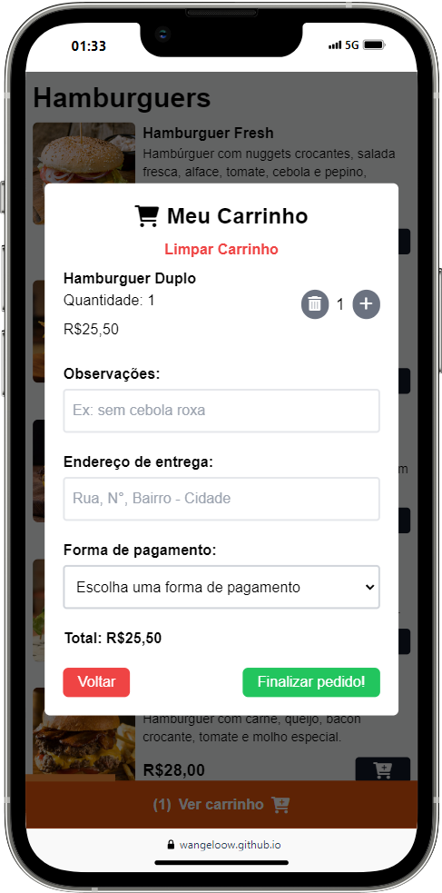

# Burguerito

  
CONFIGURAÇÃO DO GIT

  
  
  
  

MODAL ABERTO

IMG PEDIDO WHATS
https://prnt.sc/k_0lyfKU5nEO

--------------------------------------------------------------------------------------------------------

 

  <table>
    <tr>
      <td><a href="https://wangeloow.github.io/Burguerito/">Deploy</a></td>
    </tr>
  </table>

- [x] trocar variável quantiy
- [x] trocar . por , nos valores
- [x] mudar cor da página
- [x] mensagem amarela quando algo for adicionado ao carrinho
- [x] mudar carrinho para quantidade ao invés de itens
- [X] add descrição e nome real do site
- [x] resolver problema do tamanho do modal
- [x] botão de adicionar ou remover quantidade de itens no próprio modal
- [x] add observação
- [x] add total na mensagem do whatsapp
- [x] no modal, colocar o valor para baixo
- [x] add whats, face, instagram
- [x] add barra de rolagem
- [x] add descrição, valor e nome real dos itens
- [x] arrumar tamanho do precisa de troco
- [x] add msg de pagamento e troco no zap
- [x] só aparecer informações caso tenha algo no carrinho
- [x] opção de limpar carrinho
- [x] se for um item apenas, aparece uma lixeira
- [x] colocar valor em ordem crescente
- [x] botão de apagar do carrinho
- [x] arrumar problema de abrir pedido mesmo fora de horário (centralizar mensagem)
- [x] zoom na imagem ao clicar

- [ ] testar versões mobile
- [ ] add foto do projeto no README (com foto da msg do zap)