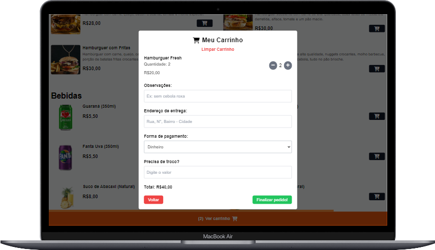

# Burguerito

  
<strong>VISÃO GERAL DO SITE</strong>

  
  
  

--------------------------------------------------------------------------------------------------------
 

  
<strong>MODAL DO CARRINHO</strong>

  
  
  

--------------------------------------------------------------------------------------------------------
 

  
<strong>PEDIDO NO WHATSAPP</strong>

  
  

--------------------------------------------------------------------------------------------------------
 

  
<strong>TECNOLOGIAS USADAS</strong>

  - HTML
  - CSS
  - JavaScript
  - TailwindCSS
  - Node.js

--------------------------------------------------------------------------------------------------------
 

  
<strong>FUNCIONALIDADS</strong>

- **100% Responsivo:** O site é totalmente adaptável a diferentes tamanhos de tela e dispositivos.
- **Adição e Remoção de Itens:** É possível adicionar e remover itens diretamente no menu ou pelo modal. Uma notificação é exibida ao adicionar itens ao carrinho.
- **Finalização da Compra:** A compra é finalizada através do modal de carrinho.
- **Limpar Carrinho:** Há uma opção para limpar o carrinho dentro do modal.
- **Carrinho Vazio:** Se o carrinho estiver vazio, uma mensagem será exibida em vez do modal de informações.
- **Observações no Pedido:** É possível adicionar observações ao pedido.
- **Opções de Pagamento:** Aceita pagamentos por Pix, cartão de crédito, débito e dinheiro, com a possibilidade de digitar o troco, se necessário.
- **Estado da Hamburgueria:** O envio do pedido é impedido se a hamburgueria estiver fechada, com uma notificação exibida.
- **Zoom nas Imagens:** Ao clicar na imagem do item desejado, ela abre em forma de zoom.
- **Barra de Rolagem:** A barra de rolagem indica quando o usuário está perto do fim do cardápio.

--------------------------------------------------------------------------------------------------------
 

  <a href="https://wangeloow.github.io/Burguerito/"><strong>Deploy</strong></a>

